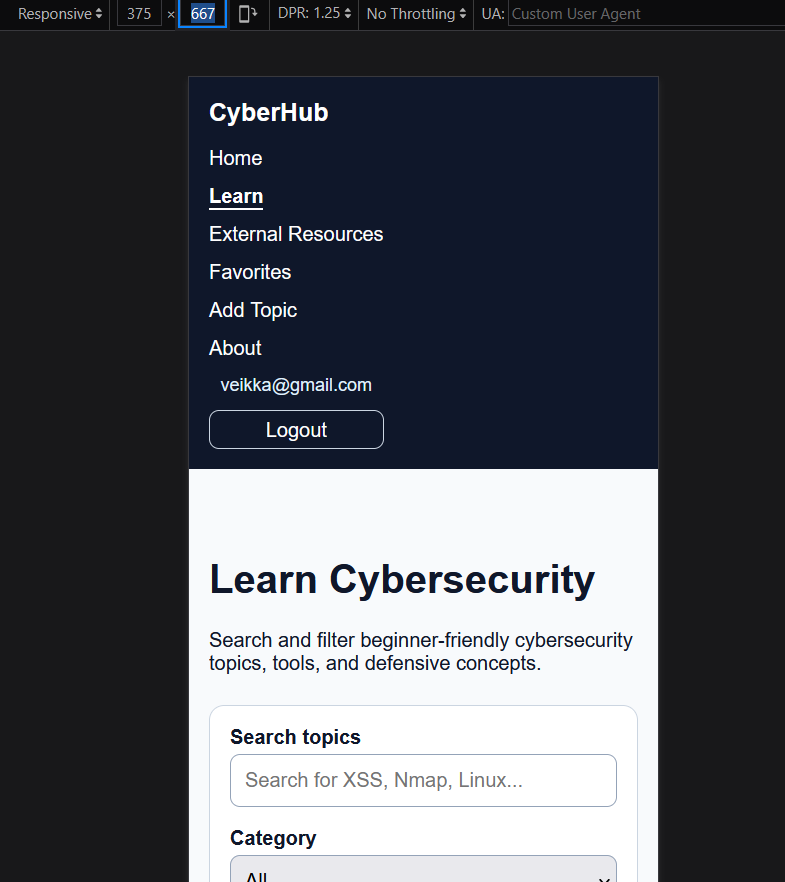
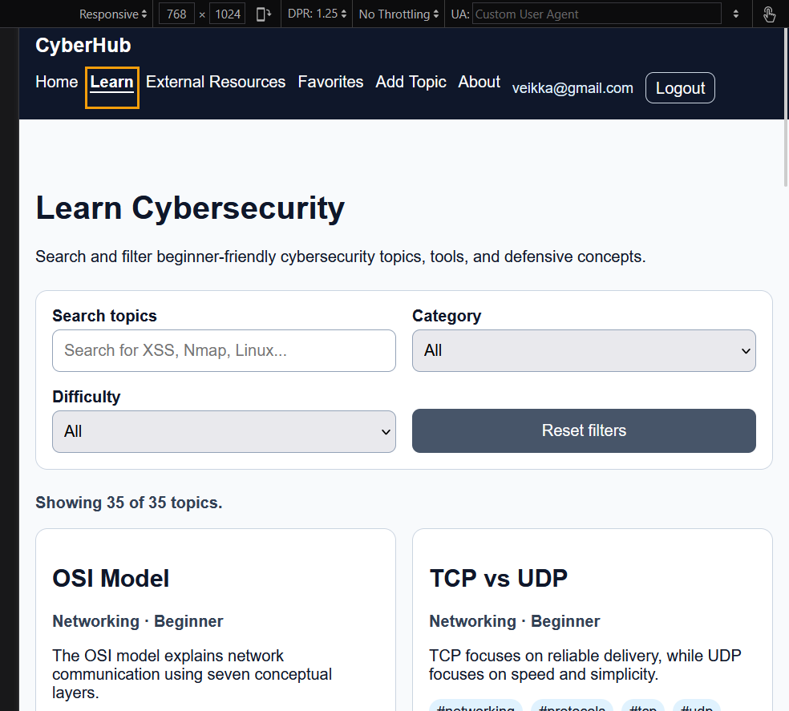
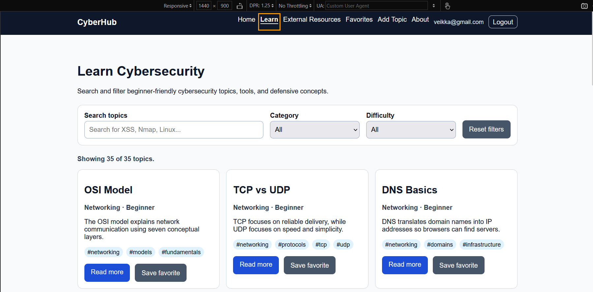

## Selitys sivun tarkoituksesta ja miten se toimii
CyberHub on kyberturvallisuuden oppimissivusto, joka auttaa käyttäjiä tutustumaan käytännön tietoturva-aiheisiin selkeällä ja aloittelijaystävällisellä tavalla. Sivusto sisältää oppimiskortteja verkottumisesta, Linuxista, verkkoturvallisuudesta, kyberturvallisuustyökaluista, Blue Team Defense -puolustuksesta, kryptografiasta ja keskeisistä tietoturvaterminologioista.

Käyttäjät voivat hakea aiheita, suodattaa niitä luokan ja vaikeustason mukaan, avata yksityiskohtaisia ​​"Lue lisää"(Read more)-sivuja ja tallentaa hyödyllisiä aiheita suosikeiksi kirjautumisen jälkeen. Sivusto käyttää Firebase-todennusta kirjautumiseen, Firestorea kunkin käyttäjän tallennettujen suosikkien tallentamiseen ja GitHub REST -rajapintaa ulkoisten kyberturvallisuuden oppimisresurssien etsimiseen.

Sivusto on suunniteltu yhtenäisellä asettelulla, jaetulla navigoinnilla, responsiivisilla korteilla, esteettömillä lomaketunnisteilla, näkyvillä kohdistustyyleillä, palauteviesteillä ja mobiiliystävällisillä näkymillä. Tämä tekee tiedoista helppoja selata tietokoneella, tabletilla ja mobiililaitteilla.

## Responsiivisuus 

Responsiivisuutta testattiin selaimen kehittäjätyökaluilla 375 pikselin, 768 pikselin ja 1440 pikselin leveyksillä. 

375 × 667(puhelin): Navigointi onnistuu sujuvasti ja teksti näkyy selkeästi  
768 × 1024(tabletti): Korteissa käytettiin kahta saraketta, navigointi rivittyi oikein, lomakkeet pysyivät luettavina
1440 × 900(pyötäkone): Korteissa käytettiin kolmea saraketta, asettelussa oli hyvät rivivälit ja navigointi pysyi vaakasuorassa.

