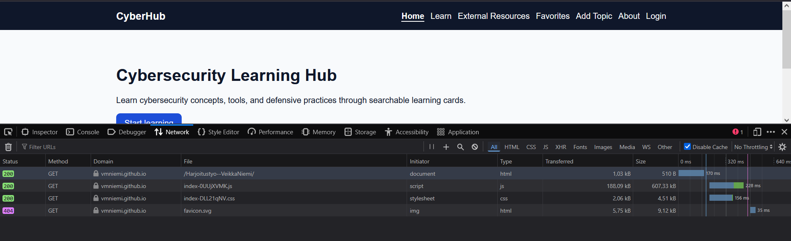
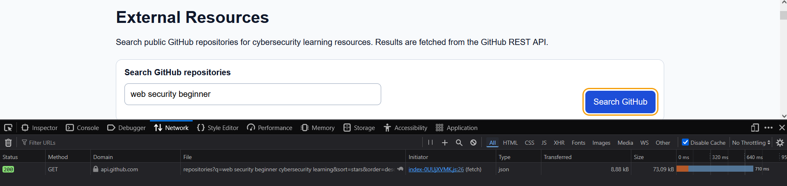
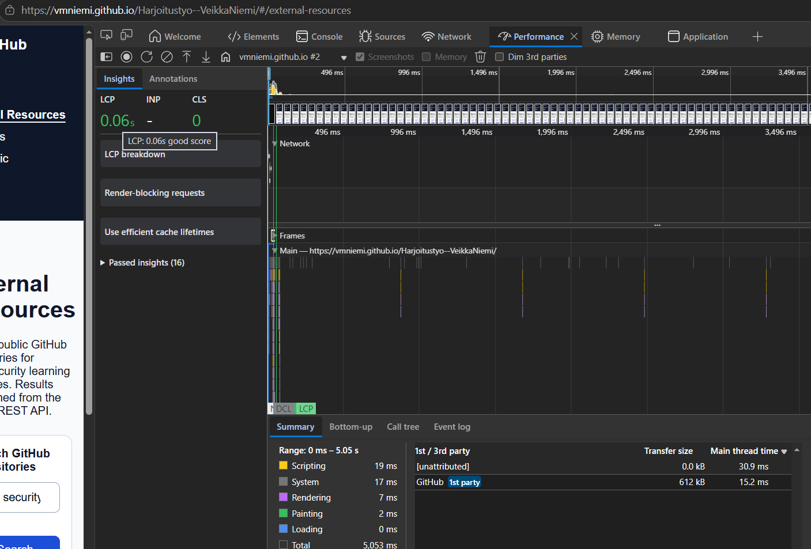

## Selitys sivun tarkoituksesta ja miten se toimii
CyberHub on kyberturvallisuuden oppimissivusto, joka auttaa käyttäjiä tutustumaan käytännön tietoturva-aiheisiin selkeällä ja aloittelijaystävällisellä tavalla. Sivusto sisältää oppimiskortteja verkottumisesta, Linuxista, verkkoturvallisuudesta, kyberturvallisuustyökaluista, Blue Team Defense -puolustuksesta, kryptografiasta ja keskeisistä tietoturvaterminologioista.

Käyttäjät voivat hakea aiheita, suodattaa niitä luokan ja vaikeustason mukaan, avata yksityiskohtaisia ​​"Lue lisää"(Read more)-sivuja ja tallentaa hyödyllisiä aiheita suosikeiksi kirjautumisen jälkeen. Sivusto käyttää Firebase-todennusta kirjautumiseen, Firestorea kunkin käyttäjän tallennettujen suosikkien tallentamiseen ja GitHub REST -rajapintaa ulkoisten kyberturvallisuuden oppimisresurssien etsimiseen.

Sivusto on suunniteltu yhtenäisellä asettelulla, jaetulla navigoinnilla, responsiivisilla korteilla, esteettömillä lomaketunnisteilla, näkyvillä kohdistustyyleillä, palauteviesteillä ja mobiiliystävällisillä näkymillä. Tämä tekee tiedoista helppoja selata tietokoneella, tabletilla ja mobiililaitteilla.

## Responsiivisuus 

Responsiivisuutta testattiin selaimen kehittäjätyökaluilla 375 pikselin, 768 pikselin ja 1440 pikselin leveyksillä. 

375 × 667(puhelin): Navigointi onnistuu sujuvasti ja teksti näkyy selkeästi  
768 × 1024(tabletti): Korteissa käytettiin kahta saraketta, navigointi rivittyi oikein, lomakkeet pysyivät luettavina
1440 × 900(pyötäkone): Korteissa käytettiin kolmea saraketta, asettelussa oli hyvät rivivälit ja navigointi pysyi vaakasuorassa.

## Toimivuus eri selaimilla

Google Chrome 148: Ei ongelmia. Sivusto latautuu oikein, navigointi toimii ja Firebase/GitHub API -ominaisuudet toimivat odotetulla tavalla.

Mozilla Firefox 150.0.3: Toiminnallisuus on kunnossa. Kaikki pääelementit latautuvat oikein, mukaan lukien suodattimet, aihesivut, kirjautuminen, suosikit ja ulkoisten resurssien haku.

Microsoft Edge 148.0.3967.70: Sivusto latautuu nopeasti ja ongelmitta. Asettelu, navigointi, todennus, suosikit ja GitHub API -haku toimivat oikein.

Safari 26.5: Pieniä visuaalisia eroja saattaa esiintyä Chromium-pohjaisiin selaimiin verrattuna, mutta asettelu ja ydintoiminnot pysyvät ennallaan.

## Sivujen latautumisaika

Latausaikaa testattiin selaimen kehittäjätyökaluilla sivuston GitHub Pages -versiossa. Verkko-välilehti osoitti, että pääasiallinen HTML-dokumentti, JavaScript-paketti ja CSS-tiedosto latautuivat onnistuneesti tilassa 200. Pääasiallinen JavaScript-paketti oli suurin tiedosto, kun taas CSS-tiedosto oli pieni. Myös GitHub API -pyyntö Ulkoiset resurssit -sivulla ajettiin onnistuneesti tilassa 200 ja kesti noin 710 ms, mikä on kohtuullinen aika kolmannen osapuolen REST API -pyynnölle. Suorituskyky-välilehti osoitti LCP:ksi 0,06 sekuntia ja CLS:ksi 0, mikä tarkoittaa, että pääsisältö ilmestyi nopeasti ja asettelu pysyi vakaana. Kaiken kaikkiaan verkkosivuston latausaika oli kohtuullinen testauksen aikana. Puuttuva favicon palautti 404-virheen, mutta se ei vaikuttanut verkkosivuston toimintaan.

